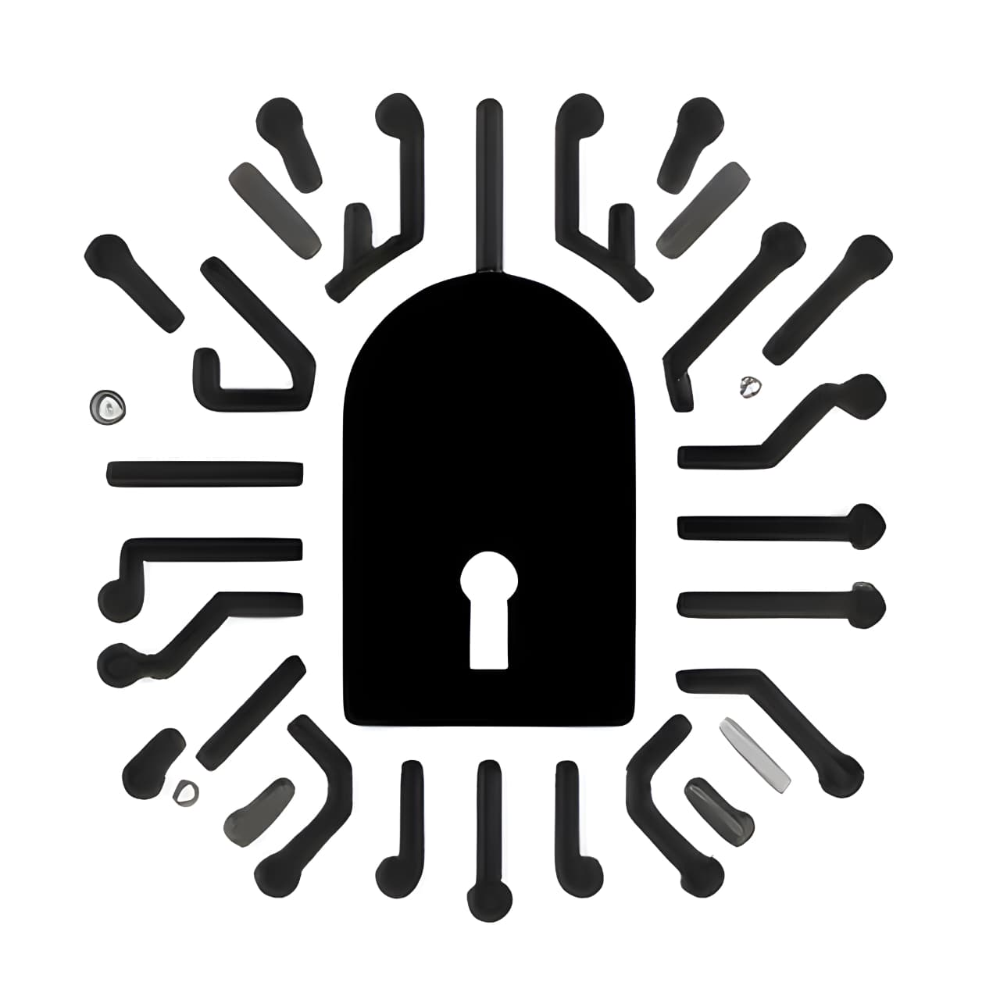

# Securefy - Smart Locker System 🔐

Securefy is a next-generation smart locker management system designed for modern campuses and facilities. It features a cutting-edge "Antigravity" UI, biometric security integration, and seamless reservation management.



## 🚀 Key Features

### 🌟 UI/UX Excellence
-   **Antigravity Hero Section**: A stunning, interactive fluid animation (Cyan/Purple/Pink) that trails the mouse with a heavy, underwater feel.
-   **Frosted Glass Aesthetics**: High-blur (60px) navigation bars and glassmorphism cards for a premium, 2025 look.
-   **Theme Adaptation**: Fully responsive Light and Dark modes with dynamic gradient meshes.
-   **Interactive 3D Elements**: Parallax backgrounds and floating UI components.

### ⚡ Core Functionality
-   **Smart Reservations**: Book lockers instantly via QR or ID.
-   **Biometric Security**: Integration with FaceID and Fingerprint scanners.
-   **Real-time Analytics**: Dashboard for usage tracking and occupancy rates.
-   **Mobile First**: Touch-optimized interface with a custom backdrop-blur mobile menu.

## 🛠 Tech Stack
-   **Frontend**: React.js, Vite
-   **Styling**: CSS-in-JS, Native CSS Variables, Responsive Grid/Flexbox
-   **Icons**: React Icons (FontAwesome 5)
-   **Animation**: Native CSS Transitions & Keyframes (60fps optimized)

## 📦 Installation

1.  **Clone the repository**
    ```bash
    git clone https://github.com/Mohamad-Riyas/Securefy--Smart-Locker-System.git
    ```

2.  **Install dependencies**
    ```bash
    npm install
    ```

3.  **Run Development Server**
    ```bash
    npm run dev
    ```

4.  **Build for Production**
    ```bash
    npm run build
    ```

## 👨‍💻 Team
-   **Branavaram**: Project Lead & Backend Architect
-   **Dhanush**: Hardware Systems Engineer
-   **Mohamad Riyas**: UI/UX Design Lead
-   **Aqeel**: Security & Testing Lead
-   **Shehan Randhil**: Operations Director

---
© 2025 Securefy Inc. All rights reserved.
